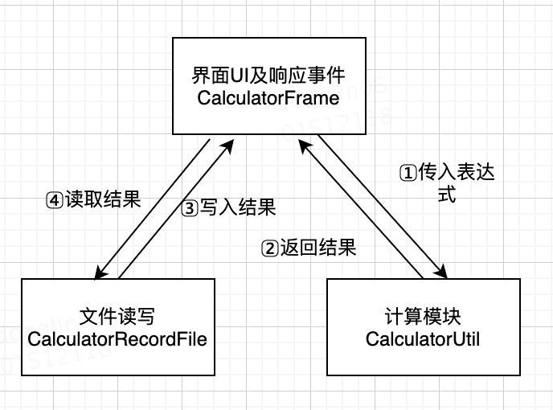
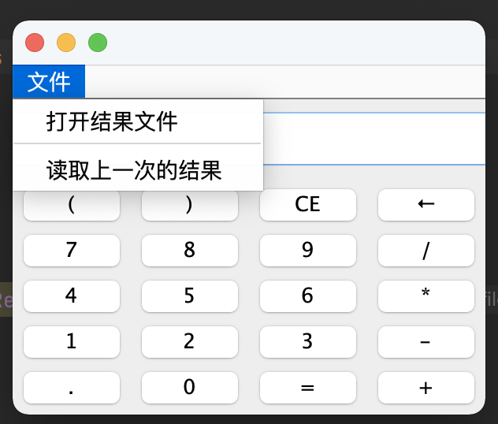

# Calculator

## 一、功能要求：

1、图形界面；

2、程序支持算术运算加、减、乘、除和等号（用户点击等号后显示结果）以及清除（清除最后输入的一个字符）和全清除（清除所有输入）；

3、用户可以连续输入，如1+2ⅹ3 =，系统要输出计算结果，即7；

4、用户还可以输入（），如（1+2）ⅹ3 =，系统要输出计算结果9；

5、如果用户输入的算式有错误，要给用户提示；

6、记录每次使用计算器时所有的正确的计算并可以查看；

7、每次使用计算器后能够将所有的正确的计算保存到文本文件中。

## 二、整体架构

## 三、设计思路

该计算器程序分为三个模块

- CalculatorFrame.class

  界面UI及响应事件：该类通过使用Swing定义了计算器的图形化界面以及图形化界面的按钮点击菜单点击等事件，通过事件响应完成计算器的功能。

- CalculatorUtil.class

  计算模块：该类是一个工具类，定义了一个传入字符串返回Double结果的calculator()方法，该方法通过先将表达式转化为后缀表达式，再利用栈的输入输出对表达式进行计算，得到结果。

  如果表达式在运行过程中导致错误，表示表达式输入有问题，则抛出异常，前端响应异常弹窗提醒用户输入表达式错误。

- CalculatorRecordFile.class

  文件读写：该类表示一个文件读写对象，通过前端传入文件路径filePath构造一个文件读写对象实例，在每次计算返回结果后会自动调用该对象的write()方法将表达式和结果写入test.txt文件。通过前端的菜单按钮绑定该对象的读取文件和读上一次计算方法。

## 四、程序运行

执行CalculattorFrame.class文件中的main方法，会运行计算器程序并通过点击实现相应功能。

